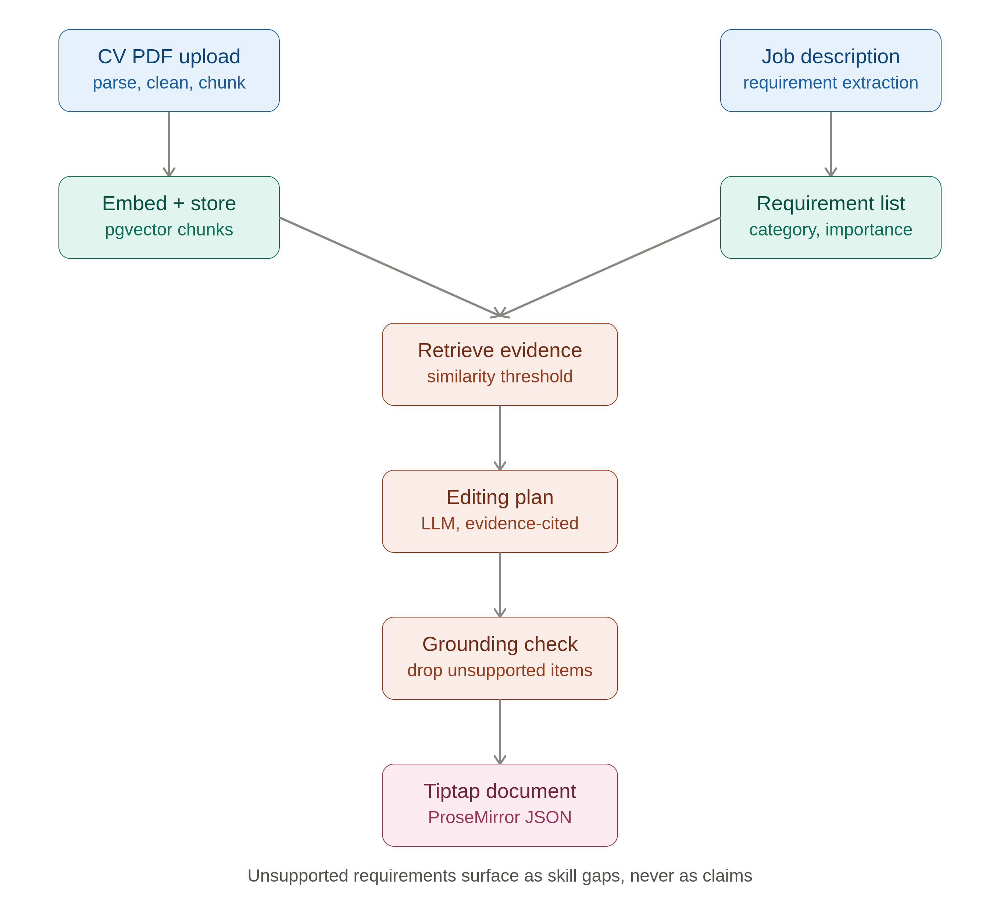
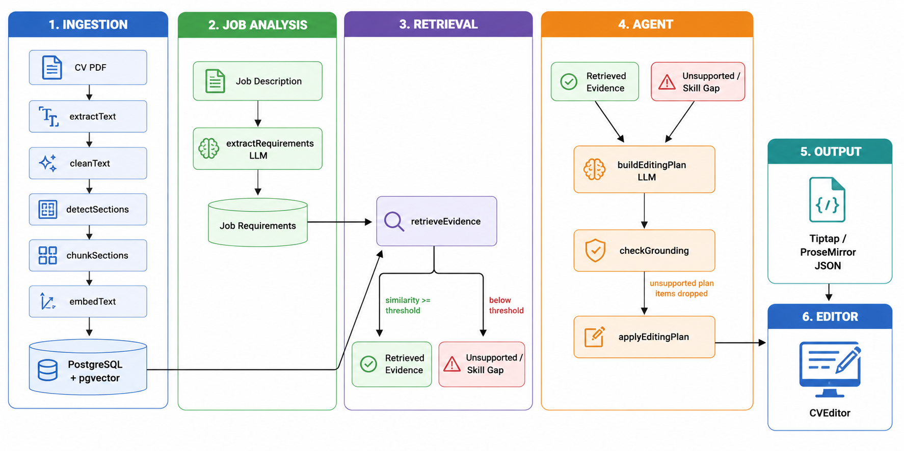

# CVForge

**Grounded CV-tailoring agent using Retrieval-Augmented Generation (RAG), PostgreSQL/pgvector semantic search, and agentic document editing with Tiptap.**

CVForge tailors an existing CV to a specific job description **using only evidence actually present in the user's CV**.

The system extracts and indexes CV content, analyzes a job description into structured requirements, retrieves supporting evidence using pgvector, generates an explicit editing plan, validates that plan against the retrieved evidence, and applies the approved changes to a structured Tiptap/ProseMirror document.

> **Core product promise:**  
> **Tailor my CV to this job using only my actual experience.**

## Grounding Guarantee

Grounding is the central constraint of CVForge.

The agent **must never invent or imply**:

- Skills
- Technologies
- Companies
- Roles
- Projects
- Responsibilities
- Achievements
- Metrics
- Experience

that are not supported by retrieved CV evidence.

If a job requirement cannot be supported by the indexed CV, CVForge does **not** guess or fabricate an answer. Instead, the requirement is returned as a **skill gap** and remains outside the tailored CV.

The grounding pipeline is:

```text
Job Requirement
       ↓
Semantic Retrieval
       ↓
CV Evidence
       ↓
Editing Plan
       ↓
Grounding Check
       ↓
Approved Changes
       ↓
Tiptap Document
```

Every non-gap editing-plan item must reference the specific requirement it addresses and the evidence chunk(s) supporting the change.

---

## Architecture


---
## More Detailed Architecture

---

## End-to-End Flow

CVForge follows this sequence:

```text
1. Upload CV
       ↓
2. Extract PDF text
       ↓
3. Clean and normalize text
       ↓
4. Detect CV sections
       ↓
5. Chunk CV content
       ↓
6. Generate embeddings
       ↓
7. Store chunks in PostgreSQL/pgvector
       ↓
8. Paste job description
       ↓
9. Extract structured job requirements
       ↓
10. Retrieve CV evidence for each requirement
       ↓
11. Identify supported requirements and skill gaps
       ↓
12. Generate an explicit editing plan
       ↓
13. Run grounding validation
       ↓
14. Apply approved document transformations
       ↓
15. Render tailored CV in Tiptap
       ↓
16. Allow further evidence-constrained edits
```

---

## Features

### CV ingestion

- PDF-only CV upload
- PDF text extraction
- Text cleaning and normalization
- De-hyphenation of line-wrapped words
- Repeated header/footer removal
- CV section detection
- Retrieval-oriented chunking
- Chunk metadata extraction
- Embedding generation
- PostgreSQL/pgvector storage

Supported CV sections include:

- Work experience
- Education
- Skills
- Projects
- Summary
- Other

Chunk metadata includes:

```text
section
type
company
role
project
date
technology
```

Metadata that cannot be clearly supported by the source CV is stored as `null` rather than guessed.

---

### Job description analysis

Users paste a job description as plain text.

CVForge extracts structured requirements across:

- Required technologies
- Preferred technologies
- Responsibilities
- Technical skills
- Domain knowledge
- Experience requirements
- Keywords

Each requirement is classified as either:

```text
required
preferred
```

The importance signal is derived from the language of the job description rather than invented by the system.

---

### Retrieval-Augmented Generation

For every extracted job requirement, CVForge performs semantic retrieval against the user's indexed CV chunks.

Each retrieval result contains:

```text
requirementId
chunkId
similarityScore
metadata
content
```

Only evidence retrieved from the user's CV may be used to support a later CV claim.

If no chunk reaches the configured similarity threshold, the requirement becomes:

```json
{
  "unsupported": true
}
```

This is surfaced as a skill gap.

---

### Agentic tailoring

The agent does not directly rewrite the CV.

Instead, it first creates an explicit editing plan.

An editing-plan item contains:

```text
requirementId
evidenceChunkIds
changeType
description
```

Supported change types are:

```text
emphasize
reorder
rephrase
deemphasize
flag_gap
```

The agent can therefore:

- Emphasize relevant existing experience
- Reorder existing content
- Rephrase existing content
- De-emphasize less relevant content
- Flag unsupported requirements as skill gaps

It cannot introduce unsupported experience.

---

### Grounding enforcement

Before any editing plan is applied, CVForge performs a grounding check.

The grounding check verifies that every non-`flag_gap` editing-plan item:

1. References a valid job requirement.
2. References at least one evidence chunk.
3. References evidence that was actually retrieved for that requirement.

Unsupported plan items are dropped and logged before the document is returned.

This creates a second validation layer after the LLM-generated plan.

---

### Tiptap document editor

The tailored CV is returned as structured Tiptap/ProseMirror-compatible JSON rather than plain text.

The editor preserves document structure such as:

- Headings
- Paragraphs
- Lists

Users can also manually edit and format the CV after tailoring.

Agent changes are intended to be applied as document transformations rather than regenerating the entire document from scratch.

The UI also exposes:

- A plain-language change summary
- Identified skill gaps
- Visual indication of recently changed content

---

## Tech Stack

### Client

- React
- Vite
- Tiptap
- ProseMirror
- Axios

### Server

- Node.js
- Express
- Multer
- PostgreSQL
- pgvector
- PDF text extraction
- Configured LLM provider
- Configured embedding provider

### Shared

Shared interfaces live in:

```text
/shared/types
```

The shared contract includes:

```text
DocumentRecord
Chunk
Session
JobRequirement
RetrievedEvidence
EditingPlanItem
TailoredDocument
```

Keeping these interfaces in one location ensures that ingestion, retrieval, agent, and editor components use the same evidence contract.

---

## Project Structure

The planned project structure is:

```text
CVForge/
├── client/
│   ├── src/
│   │   ├── components/
│   │   │   └── CVEditor.tsx
│   │   ├── pages/
│   │   │   ├── UploadPage.tsx
│   │   │   ├── JobDescriptionPage.tsx
│   │   │   └── TailorPage.tsx
│   │   └── services/
│   │       ├── api.ts
│   │       ├── documentService.ts
│   │       ├── jobService.ts
│   │       └── agentService.ts
│   └── vite.config.ts
│
├── server/
│   ├── src/
│   │   ├── config/
│   │   │   ├── providers.ts
│   │   │   └── retrievalConfig.ts
│   │   ├── controllers/
│   │   ├── db/
│   │   │   └── schema.sql
│   │   ├── middleware/
│   │   ├── routes/
│   │   └── services/
│   │       ├── pdfExtractionService.ts
│   │       ├── textCleaningService.ts
│   │       ├── sectionDetectionService.ts
│   │       ├── chunkingService.ts
│   │       ├── requirementExtractionService.ts
│   │       ├── retrievalService.ts
│   │       └── agent/
│   │           ├── editingPlanService.ts
│   │           ├── groundingCheckService.ts
│   │           └── documentTransformService.ts
│   └── .env.example
│
├── shared/
│   └── types/
│       └── index.ts
│
├── package.json
└── README.md
```

---

## Requirements

Before running CVForge, install/provide:

- Node.js
- npm
- PostgreSQL
- PostgreSQL `pgvector` extension
- API key for the configured embedding provider
- API key for the configured LLM provider

The application is designed as a **solo, one-day MVP** and does not include authentication.

---

## Setup

### 1. Clone the repository

```bash
git clone <repository-url>
cd CVForge
```

### 2. Install dependencies

Install all workspace dependencies from the repository root:

```bash
npm install
```

The repository uses workspaces for:

```text
client
server
```

---

### 3. Configure PostgreSQL

Create a PostgreSQL database with the `pgvector` extension available.

Enable the extension:

```sql
CREATE EXTENSION IF NOT EXISTS vector;
```

Then run the schema:

```bash
psql "$DATABASE_URL" -f server/src/db/schema.sql
```

The database should contain the tables required for:

- Documents
- CV chunks
- Sessions

with vector storage enabled for embeddings.

---

### 4. Configure environment variables

Copy the example environment file:

```bash
cp server/.env.example server/.env
```

Configure:

```env
DATABASE_URL=your_postgresql_connection_string
EMBEDDING_API_KEY=your_embedding_provider_key
LLM_API_KEY=your_llm_provider_key
PORT=4000
```

The embedding and LLM providers are isolated behind:

```text
server/src/config/providers.ts
```

Other application modules should call the provider wrappers rather than importing provider SDKs directly.

---

### 5. Start the application

From the repository root:

```bash
npm run dev
```

This starts:

- Backend: `http://localhost:4000`
- Frontend: Vite development server

The backend health endpoint is:

```text
GET /api/health
```

Expected response:

```json
{
  "status": "ok"
}
```

---

## API Overview

### Health

```http
GET /api/health
```

Returns:

```json
{
  "status": "ok"
}
```

---

### Upload CV

```http
POST /api/documents
Content-Type: multipart/form-data
```

Accepts a single PDF CV and associates it with the current session.

Non-PDF files return:

```text
HTTP 400
```

---

### Index CV

```http
POST /api/documents/:id/index
```

Runs:

```text
extract
→ clean
→ detect sections
→ chunk
→ embed
→ store
```

Returns:

```json
{
  "status": "indexed",
  "chunkCount": 12
}
```

---

### Analyze Job Description

```http
POST /api/jobs/analyze
```

Request:

```json
{
  "sessionId": "session-id",
  "jobDescriptionText": "..."
}
```

Returns a structured list of `JobRequirement` objects.

---

### Preview Retrieval

```http
GET /api/retrieval/preview?sessionId=...
```

Returns the requirement-to-evidence mapping without running the agent.

This endpoint is intended to make retrieval quality independently inspectable during development and the grounding audit.

---

### Tailor CV

```http
POST /api/agent/tailor
```

Request:

```json
{
  "sessionId": "session-id"
}
```

The endpoint runs:

```text
retrieveEvidence
→ buildEditingPlan
→ checkGrounding
→ applyEditingPlan
```

The response contains:

```text
document
editingPlan
gaps
```

---

### Follow-up Edit

```http
POST /api/agent/edit
```

Request:

```json
{
  "sessionId": "session-id",
  "instruction": "Emphasize my backend API experience."
}
```

The instruction is processed through the same evidence-constrained editing pipeline.

---

## Session Model

CVForge does not require authentication for the MVP.

A session is created when the browser opens the application.

The session associates:

```text
Session
 ├── CV document
 ├── Indexed CV chunks
 ├── Job requirements
 └── Current document state
```

Session-scoped endpoints require a valid `sessionId`.

Missing or unknown session IDs return:

```text
HTTP 400
```

The MVP treats session data as temporary and does not require long-term retention.

---

## Provider Boundary

Embedding and LLM providers are isolated behind a single module:

```text
server/src/config/providers.ts
```

The module exposes:

```ts
embedText(text)
generateCompletion(input)
```

No other module should import an embedding or LLM provider SDK directly.

This makes the provider implementation replaceable without changing the ingestion, retrieval, or agent logic.

---

## Grounding Audit

The most important demo is the grounding test.

### Test setup

Use a CV containing a known technology set, for example:

```text
Node.js
PostgreSQL
Express
React
```

Then provide a job description containing:

```text
Required:
- Node.js
- PostgreSQL
- Kubernetes
```

where `Kubernetes` is intentionally absent from the CV.

### Expected behavior

CVForge should:

1. Retrieve evidence for `Node.js`.
2. Retrieve evidence for `PostgreSQL`.
3. Fail to retrieve supporting evidence for `Kubernetes`.
4. Mark `Kubernetes` as a skill gap.
5. Emphasize relevant existing CV content.
6. Never add `Kubernetes` to the CV.
7. Display `Kubernetes` only in the skill-gap panel.

The critical assertion is:

```text
Technology absent from CV
        ↓
No supporting evidence
        ↓
Skill gap
        ↓
NEVER appears as a CV claim
```

This is the primary anti-hallucination demonstration for the MVP.

---

## Demo Script

Run the following sequence for the end-to-end demo.

### 1. Start the application

```bash
npm run dev
```

### 2. Upload a CV

Upload a PDF CV.

Wait for extraction, chunking, embedding, and indexing to complete.

Confirm that the UI displays the resulting chunk count.

### 3. Enter a job description

Paste a realistic backend-engineering job description.

Submit it for analysis.

Confirm that the requirements are displayed by category with:

```text
Required
Preferred
```

importance indicators.

### 4. Preview retrieval

Use the retrieval preview endpoint during development to inspect:

```text
Requirement
→ CV chunk
→ Similarity score
```

Confirm that supported requirements have evidence and unsupported requirements are explicitly identified.

### 5. Tailor the CV

Click:

```text
Tailor to this job
```

The backend should execute:

```text
Requirements
→ Retrieval
→ Editing Plan
→ Grounding Check
→ Document Transformation
```

### 6. Review changes

Inspect:

- Tailored CV
- Change summary
- Skill gaps
- Recently changed content

### 7. Test the grounding constraint

Verify that any technology absent from the CV appears only as a skill gap.

It must **not** appear as a claim in the tailored document.

### 8. Test a follow-up edit

Enter a follow-up instruction such as:

```text
Emphasize my API development experience.
```

Confirm that the new edit:

- Uses existing evidence
- Preserves previous tailoring
- Preserves manual edits
- Does not introduce unsupported claims

---

## Development Tasks

The MVP is intentionally divided into seven sequential tasks.

| Task | Feature | Time |
|---|---|---:|
| TASK-0 | Foundation, shared types, provider configuration | 1h |
| TASK-1 | CV ingestion pipeline | 2h |
| TASK-2 | Job description analysis | 1h |
| TASK-3 | RAG retrieval service | 1h |
| TASK-4 | Agentic tailoring engine | 2h |
| TASK-5 | Tiptap integration | 1.5h |
| TASK-6 | Integration, grounding audit, demo | 1.5h |

Target total:

```text
~10 hours
```

---

## Current Status

- [x] TASK-0 — Foundation, shared types, provider configuration
- [ ] TASK-1 — CV ingestion pipeline
- [ ] TASK-2 — Job description analysis
- [ ] TASK-3 — RAG retrieval
- [ ] TASK-4 — Agentic tailoring engine
- [ ] TASK-5 — Tiptap integration
- [ ] TASK-6 — Integration, grounding audit, demo

---

## Non-Functional Constraints

### No fabricated claims

The system must never fabricate a CV claim that is not present in retrieved evidence.

### Shared type contract

Shared interfaces are defined once under:

```text
/shared/types
```

### Error handling

Unhandled server errors should return a generic:

```text
HTTP 500
```

response.

Raw stack traces and provider API keys must never be returned to the client.

### Input validation

Session IDs and required inputs must be validated.

Invalid or missing inputs return:

```text
HTTP 400
```

with a descriptive message.

### Provider isolation

Embedding and LLM providers must remain behind the provider service boundary.

### Data privacy

CV content and job-description text should only be sent to the configured embedding and LLM providers when required to perform the application workflow.

---

## Acceptance Criteria

A successful MVP must demonstrate the following:

- The repository installs successfully with `npm install`.
- PostgreSQL has `pgvector` enabled.
- The health endpoint returns HTTP 200.
- A valid CV can be uploaded and indexed.
- Non-PDF uploads are rejected.
- CV chunks contain embeddings and required metadata.
- Job descriptions are converted into structured requirements.
- Supported requirements retrieve relevant CV evidence.
- Unsupported requirements become skill gaps.
- Every returned editing-plan item passes the grounding check.
- The tailored document is valid Tiptap/ProseMirror JSON.
- The CV remains directly editable.
- Follow-up edits preserve previous tailoring and manual edits.
- No unsupported technology or experience appears in the tailored CV.
- No API keys or raw stack traces are exposed to the client.
- The complete upload → job → tailor → edit flow works in a live run.

---

## Design Principle

CVForge is deliberately **evidence-first rather than generation-first**.

The system does not ask:

> "What would make this CV better for this job?"

It asks:

> "Which parts of this job can be supported by evidence already present in this CV, and how can that existing evidence be presented more effectively?"

That distinction is the foundation of CVForge.

---

## MVP Scope

CVForge is intentionally scoped as a **solo, one-day MVP**.

The current specification does not include:

- User authentication
- Account management
- Long-term CV storage
- Multi-user collaboration
- Production-scale infrastructure
- Complex CV template generation

The goal is to prove the core loop:

```text
CV
 ↓
Parse
 ↓
Embed
 ↓
pgvector
 ↓
Job Description
 ↓
Requirements
 ↓
Evidence Retrieval
 ↓
Grounded Agent
 ↓
Tailored CV
 ↓
Tiptap Editor
```

while maintaining the central guarantee:

> **If the CV does not contain the evidence, CVForge does not make the claim.**